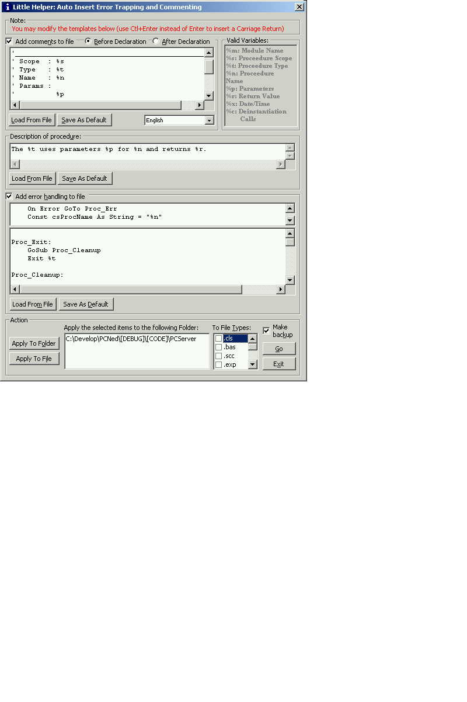



## Little Helper: Auto Insert Error Trapping / Comments Based On Templates

### Description

This application will allow users to automatically insert error trapping and procedure level header comments into files and or entire directories. This app lets users decide which types of files to apply the error handling and/or comments to. Inserted code is based upon user-defined templates. Several templates are included for starters: form error trapping (raises a message box); module/class error trapping (raises the error to the calling function - retains error stack); Comment template.

I used this program to insert error handling into itself! :)

THis app requires Microsoft ADO 2.5. This program also requires the Microsoft Scripting Runtime (scrrun.dll) which can be obtained by installing any one of the following packages: Windows Script Host Windows NT Option Pack Microsoft Internet Information Server 3.0 Scripting 3.1 upgrade Visual Studio 98 Visual Basic 6.0
 
### More Info
 

             |
---                |---
**Submitted On**   |2001-01-08 11:50:58
**By**             |[Charlie Kirkwood](https://github.com/Planet-Source-Code/PSCIndex/blob/master/ByAuthor/charlie-kirkwood.md)
**Level**          |Advanced
**User Rating**    |4.7 (28 globes from 6 users)
**Compatibility**  |VB 6\.0
**Category**       |[Complete Applications](https://github.com/Planet-Source-Code/PSCIndex/blob/master/ByCategory/complete-applications__1-27.md)
**World**          |[Visual Basic](https://github.com/Planet-Source-Code/PSCIndex/blob/master/ByWorld/visual-basic.md)
**Archive File**   |[CODE\_UPLOAD13540182001\.zip](https://github.com/Planet-Source-Code/charlie-kirkwood-little-helper-auto-insert-error-trapping-comments-based-on-templates__1-14247/archive/master.zip)

### API Declarations

see code

